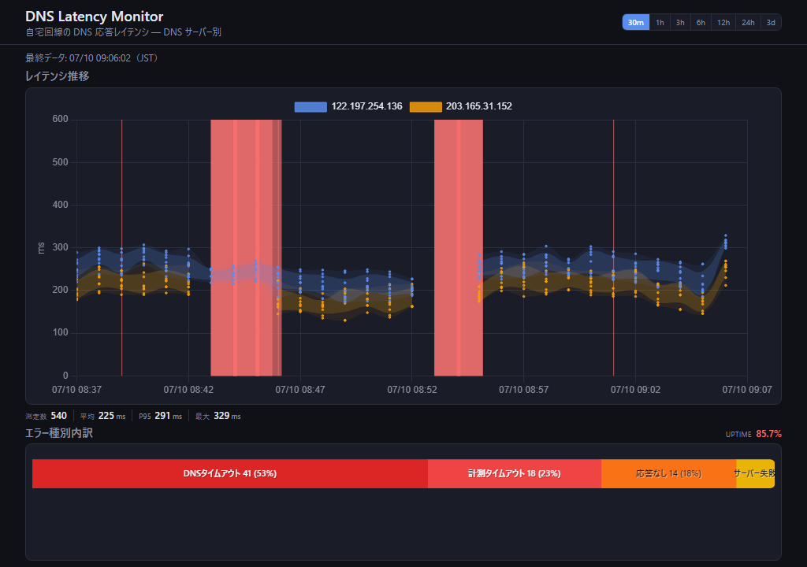
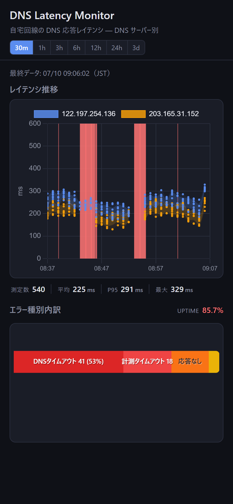

# home-monitor

自宅回線の DNS 応答レイテンシを監視し、GitHub Pages で可視化するツールです。

<p align="center">
  
  
</p>

30 分表示のサンプル（左: PC / 右: スマホ）。赤い帯はタイムアウト区間、レイテンシ直下に測定数・平均・P95・最大、下部はエラー種別内訳と Uptime です。

## ブランチ構成

| ブランチ | 内容 |
|----------|------|
| `master` | ソース（ダッシュボード、スクリプト、ワークフロー、`monitor.config.ts`） |
| `gh-pages` | 公開用ブランチ（`master` + `docs/data`） |

`master` への push で **Merge to gh-pages** が走り、ソースを `gh-pages` にマージします（`docs/data/` はそのまま残ります）。**Sync DNS Data** は計測データを `gh-pages` の `docs/data/` に直接書き込みます。続けて **Deploy Pages** が `gh-pages` からビルドして公開します（bot による push では後続ワークフローが起動しないため、`workflow_run` で連鎖させています）。

GitHub Pages は **GitHub Actions** でデプロイします（Settings → Pages → GitHub Actions）。

## 仕組み

1. **Windows PC** — 1分ごとに `nslookup` を実行し、レイテンシをローカル TSV に記録
2. **10分ごと** — `gh workflow run` で未送信データをワークフローへ送信（失敗時は自動リトライ）
3. **GitHub Actions** — `gh-pages` の `docs/data/` を更新 → Pages デプロイ
4. **ダッシュボード** — `https://www.nahcnuj.work/home-monitor/` でグラフ表示

## セットアップ

### 1. GitHub リポジトリ

```powershell
git remote add origin https://github.com/nahcnuj/home-monitor.git
git push -u origin master
```

GitHub の **Settings → Pages → Build and deployment → GitHub Actions** を有効化してください。

### 2. GitHub CLI

[GitHub CLI](https://cli.github.com/) をインストールし、認証:

```powershell
gh auth login
```

### 3. タスクスケジューラ登録

管理者 PowerShell で実行:

```powershell
cd C:\Users\nahcnuj\ghq\github.com\nahcnuj\home-monitor
.\scripts\install-scheduled-task.ps1
```

| タスク名 | 間隔 | 内容 |
|----------|------|------|
| `HomeMonitor-DNS-Collect` | 1分 | nslookup 計測 |
| `HomeMonitor-DNS-Publish` | 10分 | GitHub へデータ送信 |

### 4. 動作確認

```powershell
# 計測テスト
.\scripts\collect-dns.ps1

# 送信テスト（gh auth login 後）
.\scripts\publish-data.ps1
```

GitHub の Actions タブで **Sync DNS Data** ワークフローが起動することを確認してください。

タスクスケジューラから送信されない場合は `data/local/publish.log` を確認してください（`monitor.config.ts` 読み込みや `gh` の PATH 問題などが記録されます）。

## データ形式

### 収集・アップロード (TSV)

1行 = 1回の nslookup（ドメイン単位の生データ）。ローカル保存と GitHub への送信は TSV のままです。

成功:

```
1718863200	203.165.31.152	google.com	42
```

失敗:

```
1718863260	203.165.31.152	cloudflare.com	60000	dns_timeout
```

2列目は名前解決に使った DNS サーバーの IP、3列目はクエリ先ドメインです。

### ダッシュボード (JSON)

GitHub Actions（**Sync DNS Data** / **Deploy Pages** の `prepare-pages`）が TSV を `DnsRecord[]` の JSON に変換し、ブラウザは `data/dns-latency.json` を読みます。変換は `npm run tsv-to-json`（`scripts/tsv-to-json.ts`、`parseTsv` と同じ規則）です。

[`monitor.config.ts`](monitor.config.ts) の `data_cutoff_ts`（Unix 秒）より古い行は保存・表示・送信の対象外です。GitHub 上のデータは最大 7 日分保持されます。ダッシュボードの表示範囲（30m / 1h / 3h / 6h / 12h / 24h / 3d）は UI から切り替えでき、選択はブラウザに保存されます。`display_hours`（デフォルト 24）は初回表示の初期値のみです。

**24h 以下**でグラフがビューポートより広くなるとき（だいたい 6h 以上）、時間軸方向に横スクロールできます（初期位置は右端＝最新）。Y 軸（ms）は左端に固定、凡例はグラフ上に固定し、プロットだけが横に動きます。短時間（例: 30m）で幅に収まる場合や **3d** は、従来どおり画面幅にフィットします。

## 設定

[`monitor.config.ts`](monitor.config.ts) が唯一の設定ファイルです。ダッシュボードはビルド時に取り込み、PowerShell スクリプトは `npm run read-config` 経由で読み取ります。

- `domains` — クエリ先ドメイン一覧
- `lookup_timeout_sec` — `nslookup -timeout=N`（デフォルト **60 秒**）。**`-retry=0` は使わない**（Windows では即 `No response from server` になる既知の挙動）。記録 ms は nslookup 開始〜終了の壁時計
- `job_timeout_sec` — ジョブ打ち切り（デフォルト **70 秒**）。nslookup が戻らないとき `job_timeout`
- `data_cutoff_ts` — これより古いデータを除外
- `display_hours` — ダッシュボード初回表示の時間範囲
- `publish_interval_min` — データ送信間隔（分、タスク再登録が必要）
- `publish_max_attempts` — 送信失敗時の最大試行回数
- `publish_retry_delays_sec` — リトライ待ち時間（秒）の配列

複数ドメインは並列で `nslookup` するため、1分間隔の計測でも全体の所要時間はおおむねタイムアウト値程度です。

旧形式・カットオフ以前のデータを削除する場合:

```powershell
.\scripts\purge-domain-data.ps1          # ローカル TSV を整理
.\scripts\purge-domain-data.ps1 -Republish  # 整理後に GitHub へ全件再送
```

## ダッシュボード開発 (Vite + TypeScript)

ソースは `dashboard/src/`。ビルド成果物は `dashboard/dist/` に出力され、CI が `gh-pages` からビルドして Pages へ公開します。

```powershell
npm install
npm run dev      # data/local の TSV を参照（設定は monitor.config.ts）
npm run build    # dashboard/dist/ に出力
npm run typecheck
npm test
```

公開 TSV をローカルで確認したい場合:

```powershell
.\scripts\fetch-data-branch.ps1   # gh-pages の docs/data を取得（gitignore 済み）
```

UI や設定を `master` に push すると **Merge to gh-pages** → **Deploy Pages** が順に走ります。

## ファイル構成

```
monitor.config.ts         共通設定（唯一のソース）
scripts/collect-dns.ps1   計測スクリプト
scripts/publish-data.ps1  データ送信
scripts/Get-MonitorConfig.ps1  PS から設定を読むヘルパー
scripts/merge-gh-pages.sh master → gh-pages マージ
scripts/install-scheduled-task.ps1  タスク登録
dashboard/                ダッシュボードソース (Vite + TS)
data/local/               ローカルデータ (gitignore)
docs/                     ローカルプレビュー用 TSV キャッシュ (gitignore)
```

`gh-pages` ブランチ:

```
dashboard/ scripts/ monitor.config.ts package.json ...
docs/data/dns-latency.tsv
```